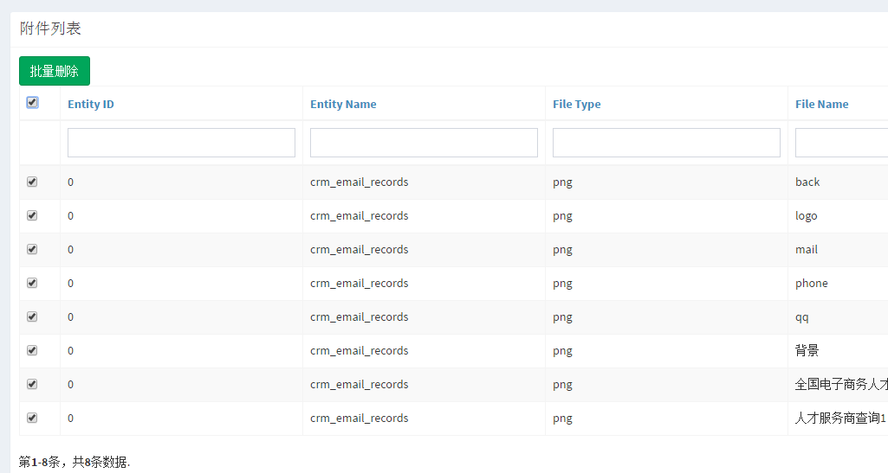

yii2-library
--

>common library for yii2

修改配置文件
--

> file: config/web.php,config/console.php

```php

    'modules' => [
        'library'=>[
            'class'=>'liumapp\library\Module'
        ],
    ],
    
```

初始化基本数据库
--
```sh

php yii migrate --migrationPath=@vendor/liumapp/yii2-library/migrations

```

创建管理员
--

```sh
php yii library/create-admin  管理员 $username $password $youremail
```

批量删除 
--
```
liumapp\library\widgets\BatchDelete::widget()
```

默认使用当前控制器下的ActionDelete 也可以手动指定 /attachment/default/delete ,然后根据主键id实现批量删除

```
liumapp\library\widgets\BatchDelete::widget(['url'=>'attachment/default/delete
'])
```
必须跟GridView配合使用,把多选框显示出来

       'columns' => [
            ['class' => CheckboxColumn::className()],
            'entityId',
            ['class' => 'liumapp\library\components\ActionColumn'],
        ],


